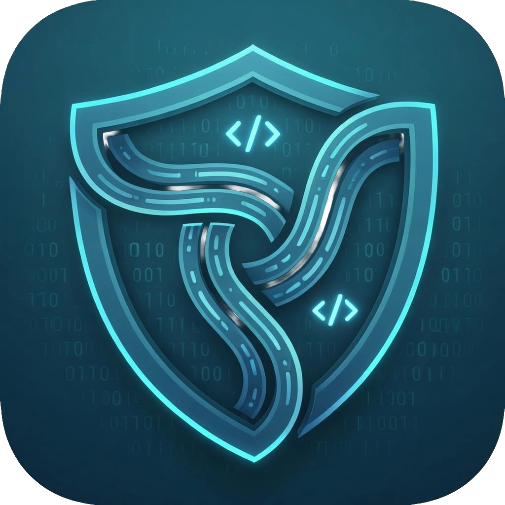

<div align="center">
  

  # VerifiMind PEAS

  **An opinionated MCP server for structured multi-LLM critique.**

  Three specialized agents — Innovation, Ethics, Security — review your concept before you build it. Multi-vendor (Gemini · Claude · GPT · Groq · Cerebras · Mistral · Ollama). Free, open-source, MCP-native.

  [](CHANGELOG.md)
  [](LICENSE)
  [](SERVER_STATUS.md)
  [](https://registry.modelcontextprotocol.io/?q=verifimind)
  [](https://verifimind.ysenseai.org/health)
  [](https://doi.org/10.5281/zenodo.17972751)
  [](https://doi.org/10.5281/zenodo.20399789)
  [](https://doi.org/10.5281/zenodo.21276884)
  [](https://huggingface.co/datasets/YSenseAI/verifimind-peas-eval)
</div>

---

## Quick Start

> Use `streamable-http` transport and the trailing slash `/mcp/`. See [docs/MCP_Server_Troubleshooting_Guide.md](docs/MCP_Server_Troubleshooting_Guide.md) if you hit issues.

**Claude Code** (one command):
```bash
claude mcp add -s user verifimind -- npx -y mcp-remote https://verifimind.ysenseai.org/mcp/
```

**Claude Desktop** ([macOS](~/Library/Application%20Support/Claude/claude_desktop_config.json) · [Windows](%APPDATA%\Claude\claude_desktop_config.json)):
```json
{
  "mcpServers": {
    "verifimind": {
      "command": "npx",
      "args": ["-y", "mcp-remote", "https://verifimind.ysenseai.org/mcp/"]
    }
  }
}
```

**Cursor / VS Code Copilot** (`.cursor/mcp.json` or `.vscode/mcp.json`):
```json
{
  "servers": {
    "verifimind": {
      "url": "https://verifimind.ysenseai.org/mcp/",
      "transport": "streamable-http"
    }
  }
}
```

After [registering](https://verifimind.ysenseai.org/register), add `--header "X-VerifiMind-UUID:${VERIFIMIND_UUID}"` to opt into the personal usage dashboard at `/early-adopters/dashboard/{uuid}`. Registration is optional.

---

## What this is

VerifiMind PEAS is an MCP server that runs your concept through **three specialized LLM judges in sequence**:

| Agent | Role | Question it answers |
|---|---|---|
| **X (Innovation)** | Innovation & competitive positioning | "Is this novel? What's the prior art? What's the strategic angle?" |
| **Z (Ethics)** | Ethics, compliance, 21-framework jurisdictional check | "What risks does this raise? GDPR, EU AI Act, SG MGF, etc." |
| **CS (Security)** | Security validation, OWASP Agentic AI Top 10 | "What can break? What's the attack surface? What's the reasoning-layer audit say?" |

Each agent sees the prior agents' reasoning. You get a unified assessment with scores, recommendations (PROCEED / REVISE / REJECT), and full reasoning chains.

**What this is not:** "Verification" in the formal-methods sense. The output is structured multi-LLM critique, not a mathematical proof. We make that distinction explicitly.

---

## The 13 tools

All 13 tools are **free for everyone** under the [Core Tools Always Free pledge](#core-tools-always-free-pledge).

### Trinity validation (4 tools)
- `consult_agent_x` — Innovation analysis with competitive positioning
- `consult_agent_z` — Ethics review with 21-framework jurisdictional coverage
- `consult_agent_cs` — Security validation, OWASP Agentic AI Top 10
- `run_full_trinity` — X → Z → CS pipeline with chain-of-thought, unified assessment

### Template management (6 tools)
- `list_prompt_templates` — Browse templates by agent, category, or tag
- `get_prompt_template` — Retrieve a template by ID
- `export_prompt_template` — Export to Markdown or JSON
- `register_custom_template` — Register a new template at runtime
- `import_template_from_url` — Import from a GitHub Gist or raw URL
- `get_template_statistics` — Registry stats by agent / phase / type

### Coordination (3 tools)
- `coordination_handoff_create` — Create a structured MACP v2.2 handoff record
- `coordination_handoff_read` — Read the most recent coordination handoff(s)
- `coordination_team_status` — Aggregate team state across stored handoffs

> **Tier identity, not paywall.** `pioneer_key` is an optional namespace identifier — omit it and your records land in the shared `"anonymous"` namespace. No tier blocks any tool.

---

## Core Tools Always Free Pledge

> All VerifiMind PEAS validation tools are free to use, forever. No paywall, no premium tier for tool access. Rate limits apply for system health only (not as monetization). Paid services, when they launch, will be consultation reports — separate from the tools.

Ratified by L (CEO) + Alton (Human Orchestrator) + T (CTO) on May 9, 2026. Active in production since v0.5.28 (May 10, 2026).

**Rate limits (system health, equal for all tiers):**
| Tier | Identity | Limit |
|---|---|---|
| Anonymous | IP only | 10 req/60s |
| Scholar | UUID (free registration) | 30 req/60s |
| EA / PILOT | UUID + email | 100 req/60s |

---

## Methodology overview

VerifiMind PEAS productizes the **multi-judge LLM evaluation pattern** — a well-established approach in the AI evaluation literature — into an opinionated MCP server with three specialized roles, a Genesis Master Prompt continuity layer, and a multi-vendor BYOK architecture.

**What's ours:**
- Productization quality of the X / Z / CS specialization
- MCP-native exposure (works in Claude Code / Cursor / VS Code / ChatGPT Codex)
- Multi-vendor design (not locked to one LLM family)
- Genesis Master Prompt — stateful continuity across multi-model workflows
- 21-framework jurisdictional coverage in the Ethics agent (GDPR · EU AI Act · SG MGF · etc.)

**What's prior art:** Multi-judge LLM evaluation, LLM-as-judge scoring, multi-model orchestration. See [Related Work](#related-work) for citations.

We do not claim the underlying methodology is novel.

---

## Architecture

The full system architecture — from the foundational X / Z / CS multi-agent validation design through the Phase 90 production deployment (MCP transport, BYOK provider layer, security hardening, FLYWHEEL coordination) — is documented in a single comprehensive, fact-checked diagram:

**→ [VerifiMind-PEAS Architecture Diagram](docs/architecture/VerifiMind-PEAS-Architecture-Diagram.md)** (v0.6.0-Beta, June 2026)

---

## Related Work

VerifiMind PEAS builds on and acknowledges:

- **ChatEval** (Chan et al., 2023, [arXiv:2308.07201](https://arxiv.org/abs/2308.07201)) — Multi-agent debate framework
- **MAJ-EVAL** — Multi-Agent-as-Judge evaluation pattern
- **CollabEval** — Collaborative LLM evaluation with role-based agents
- **HELM** ([Stanford CRFM](https://crfm.stanford.edu/helm/)) — Holistic Evaluation of Language Models
- **Inspect** ([UK AI Safety Institute](https://inspect.ai-safety-institute.org.uk/)) — Open-source safety evaluation framework
- **G-Eval / GPTScore** — LLM-as-judge scoring methodologies

Our contribution: **productization quality**, **MCP integration path**, **multi-vendor architecture**, and the **Genesis Master Prompt** continuity layer.

---

## Status & Metrics

- **Server:** `v0.6.0-Beta "Adoption First"` — [verifimind.ysenseai.org](https://verifimind.ysenseai.org) · [/health](https://verifimind.ysenseai.org/health)
- **Landing Page:** [verifimind.io](https://verifimind.io)
- **Tests:** 252+ unit/integration tests pass per release
- **Tools:** 13 (all free)
- **Providers:** 7 (Gemini · Claude · GPT · Groq · Cerebras · Mistral · Ollama) — pluggable via BYOK
- **Protocols:** MACP v2.4.1 · Genesis v2.6.1

For honest live metrics, see [`/changelog`](https://verifimind.ysenseai.org/changelog). Detailed adoption metrics (weekly cohort, return rate, conversion) are tracked internally and reviewed in [iteration handoffs](https://github.com/creator35lwb-web/verifimind-genesis-mcp). We deliberately do not display unaudited "total users" numbers — they tend to include bots and dev sessions.

---

## Common mistakes

| Mistake | Fix |
|---|---|
| Using `https://verifimind.ysenseai.org/mcp` (no slash) | Use `/mcp/` with trailing slash — required by streamable-http transport |
| Connecting via `server.smithery.ai/...` | Smithery legacy was sunset March 1, 2026. Use the direct URL above. |
| Mixing transports | Use `streamable-http`, not `http-sse` |
| Trying to call coordination tools and seeing "PIONEER_TIER_REQUIRED" | You're on v0.5.27 or older — the paywall was removed in v0.5.28 (May 10, 2026). All 13 tools are now free. |

For a fuller troubleshooting guide, see [docs/MCP_Server_Troubleshooting_Guide.md](docs/MCP_Server_Troubleshooting_Guide.md).

---

## How to cite

If you use VerifiMind PEAS in research or a project, please cite. We'd love to hear about it — open a [GitHub Discussion](https://github.com/creator35lwb-web/VerifiMind-PEAS/discussions).

### VerifiMind PEAS (server)

```bibtex
@software{verifimind_peas_2026,
  author  = {Lee, Alton and {Manus AI} and {Claude Code}},
  title   = {VerifiMind PEAS: Multi-Agent AI Validation MCP Server},
  year    = {2026},
  url     = {https://github.com/creator35lwb-web/VerifiMind-PEAS},
  doi     = {10.5281/zenodo.17980791},
  note    = {Multi-vendor MCP server for structured multi-LLM critique}
}
```

[](https://doi.org/10.5281/zenodo.17980791)

### Genesis Methodology

```bibtex
@misc{genesis_methodology_2025,
  author  = {Lee, Alton and {Manus AI}},
  title   = {Genesis Prompt Engineering Methodology: Multi-Agent AI Validation Framework},
  year    = {2025},
  url     = {https://doi.org/10.5281/zenodo.17972751},
  doi     = {10.5281/zenodo.17972751}
}
```

[](https://doi.org/10.5281/zenodo.17972751)

### MACP (Multi-Agent Communication Protocol)

```bibtex
@misc{macp_2025,
  author  = {Lee, Alton and {Manus AI}},
  title   = {MACP: Multi-Agent Communication Protocol},
  year    = {2025},
  url     = {https://doi.org/10.5281/zenodo.18504478},
  doi     = {10.5281/zenodo.18504478}
}
```

[](https://doi.org/10.5281/zenodo.18504478)

### VerifiMind PEAS Evaluation Dataset (M2)

```bibtex
@dataset{verifimind_peas_eval_2026,
  author  = {Lee, Alton},
  title   = {VerifiMind-PEAS-Eval: Multi-Model AI Validation Evaluation Dataset},
  year    = {2026},
  url     = {https://huggingface.co/datasets/YSenseAI/verifimind-peas-eval},
  doi     = {10.5281/zenodo.21276884},
  note    = {100-item dataset with 5 domains, ground-truth verdicts, multi-model scoring, and inter-annotator agreement analysis}
}
```

[](https://doi.org/10.5281/zenodo.21276884)

### Defensive Publication

A prior-art defensive publication is registered at DOI [10.5281/zenodo.17645665](https://doi.org/10.5281/zenodo.17645665).

---

## Documentation & links

| Resource | Where |
|---|---|
| Architecture diagram | [docs/architecture/VerifiMind-PEAS-Architecture-Diagram.md](docs/architecture/VerifiMind-PEAS-Architecture-Diagram.md) |
| Live server health | [verifimind.ysenseai.org/health](https://verifimind.ysenseai.org/health) |
| Server changelog | [verifimind.ysenseai.org/changelog](https://verifimind.ysenseai.org/changelog) · [CHANGELOG.md](CHANGELOG.md) |
| Server status | [SERVER_STATUS.md](SERVER_STATUS.md) |
| Roadmap | [ROADMAP.md](ROADMAP.md) |
| MCP setup troubleshooting | [docs/MCP_Server_Troubleshooting_Guide.md](docs/MCP_Server_Troubleshooting_Guide.md) |
| Research library | [/library](https://verifimind.ysenseai.org/library) · [/research](https://verifimind.ysenseai.org/research) |
| Validation Paradox reflections | [/research/paradox](https://verifimind.ysenseai.org/research/paradox) |
| Evaluation Roadmap (v1.0, tagged `roadmap-v1.0`) | [/research/evaluation-roadmap](https://verifimind.ysenseai.org/research/evaluation-roadmap) · [canonical source](docs/research/evaluation-roadmap/roadmap-v1.0.md) |
| GitHub Discussions | [github.com/creator35lwb-web/VerifiMind-PEAS/discussions](https://github.com/creator35lwb-web/VerifiMind-PEAS/discussions) |
| MCP Registry listing | [registry.modelcontextprotocol.io](https://registry.modelcontextprotocol.io/?q=verifimind) |
| Hugging Face demo | [YSenseAI/verifimind-peas](https://huggingface.co/spaces/YSenseAI/verifimind-peas) |
| **Evaluation Dataset** | [YSenseAI/verifimind-peas-eval](https://huggingface.co/datasets/YSenseAI/verifimind-peas-eval) — 100 items, 5 domains, DOI [10.5281/zenodo.21276884](https://doi.org/10.5281/zenodo.21276884) |
| Landing page | [verifimind.io](https://verifimind.io) |
| Long-form README archive (May 10, 2026 snapshot — 87-Day Journey, 8-Skill Stack, full citation library, expanded changelog) | [docs/archive/README_2026-05-10_comprehensive.md](docs/archive/README_2026-05-10_comprehensive.md) |

---

## License

VerifiMind PEAS is released under the **MIT License**. See [LICENSE](LICENSE) for the full text.

```
Copyright (c) 2025-2026 Alton Lee Wei Bin (creator35lwb)

Permission is hereby granted, free of charge, to any person obtaining a copy
of this software and associated documentation files (the "Software"), to deal
in the Software without restriction, including without limitation the rights
to use, copy, modify, merge, publish, distribute, sublicense, and/or sell
copies of the Software, and to permit persons to whom the Software is
furnished to do so, subject to the following conditions:

The above copyright notice and this permission notice shall be included in
all copies or substantial portions of the Software.

THE SOFTWARE IS PROVIDED "AS IS", WITHOUT WARRANTY OF ANY KIND, EXPRESS OR
IMPLIED, INCLUDING BUT NOT LIMITED TO THE WARRANTIES OF MERCHANTABILITY,
FITNESS FOR A PARTICULAR PURPOSE AND NONINFRINGEMENT.
```

The methodology is freely usable under MIT. Forks and derivatives must use different branding.

---

## Community

- **GitHub Discussions:** [github.com/creator35lwb-web/VerifiMind-PEAS/discussions](https://github.com/creator35lwb-web/VerifiMind-PEAS/discussions) — preferred for questions, ideas, and feedback
- **Issues:** [github.com/creator35lwb-web/VerifiMind-PEAS/issues](https://github.com/creator35lwb-web/VerifiMind-PEAS/issues) — bugs and feature requests
- **Email:** creator35lwb@gmail.com — direct contact
- **X (Twitter):** [@creator35lwb](https://x.com/creator35lwb)

For paid consultation engagements (planned, not yet active), use [GitHub Discussions](https://github.com/creator35lwb-web/VerifiMind-PEAS/discussions) or email — we'll publish service details and pricing when they're ready.

---

## Acknowledgments

VerifiMind PEAS was built collaboratively by the **FLYWHEEL TEAM** — a human orchestrator working with multiple AI agents (Manus AI, Claude Code, Perplexity, Antigravity/Gemini, GodelAI). Multi-agent coordination uses the open [MACP](https://doi.org/10.5281/zenodo.18504478) protocol.

The 87-day development journey is documented in the [Validation Paradox research collection](https://verifimind.ysenseai.org/research/paradox) and the [iteration handoffs](https://github.com/creator35lwb-web/verifimind-genesis-mcp) — written contemporaneously, not retrospectively.

External Model Council review (Claude Opus 4.7 + GPT-5.5 + Gemini 3.1 Pro, May 9, 2026) shaped the current positioning. See [docs/case-studies](docs/case-studies) for application examples.

---

**Last Updated:** June 4, 2026 · **Version:** v0.6.0-Beta "Adoption First" · **MACP:** v2.4.1 · **Genesis:** v2.6.1
